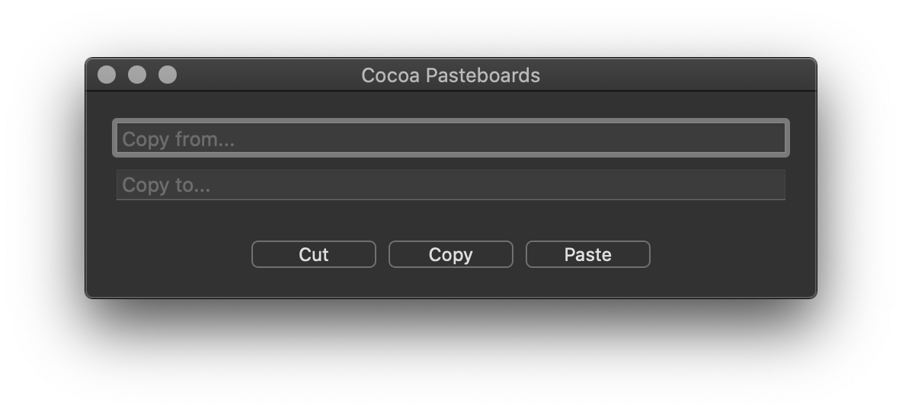

# Cocoa Pasteboards

This repository contains implementation of cut, copy and paste operations using pasteboards (NSPasteboard).

[Cocoa macOS Examples](https://github.com/NikolaGrujic91/Cocoa-macOS-Examples)

